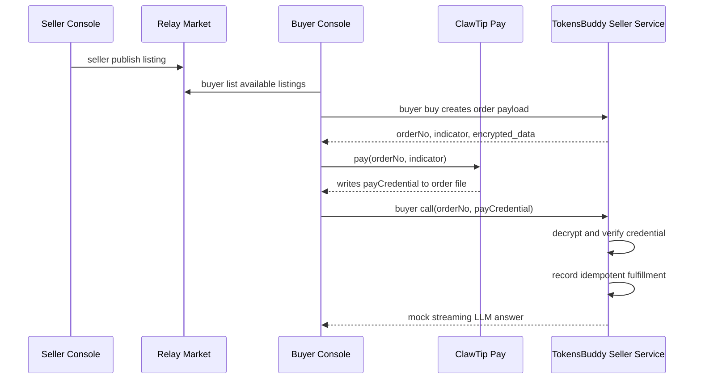

# ClawTip Console 买卖测试模块说明

**日期：** 2026-04-26
**模块范围：** ClawTip 独立买卖测试、relay 市场发布/发现、真实支付凭证校验、模拟 LLM 履约
**当前状态：** 本地闭环、真实 ClawTip 支付、真实 Nostr relay 发布/发现均已打通；LLM 调用仍为模拟实现。

## 一句话说明

这个模块是 TokensBuddy 接入 ClawTip 流付费市场之前的独立验收层：卖家把一个可调用模型上架到 relay 市场，买家发现 listing 后生成 ClawTip 订单，完成每次调用前的真实支付，卖家验证支付凭证后只履约一次，最后返回模拟 LLM 流式结果。

可以把它理解成三段：

- relay 市场负责“发现谁在卖”。
- ClawTip 负责“这次调用是否已经付费”。
- TokensBuddy seller 负责“验证凭证并提供一次推理服务”。

## 设计目标

- 独立通过 console 跑通“上架、发布、购买、支付、调用”的完整流程。
- ClawTip 交易使用真实 `payTo` 和 `sm4key`，但仓库不保存任何秘密。
- relay listing 使用现有市场方向的 Nostr `kind 31990`，避免测试模块和后续市场实现分裂。
- LLM 先用模拟流式结果，支付、订单、履约和日志链路使用真实实现。
- 核心逻辑放在 Rust service 中，console 只是薄入口，后续可直接接入 Tauri、market UI 和 proxy。

## 核心流程



## 文件和模块

入口：

- `src-tauri/src/bin/clawtip-console.rs`：console 命令入口。
- `package.json`：`pnpm clawtip:console` 脚本。

核心服务：

- `src-tauri/src/services/clawtip/config.rs`：本地配置写入和 `env:` 引用。
- `src-tauri/src/services/clawtip/crypto.rs`：SM4 ECB PKCS7 Base64 加解密，兼容 ClawTip/Hutool 风格。
- `src-tauri/src/services/clawtip/credential.rs`：`payCredential` 解密和订单校验。
- `src-tauri/src/services/clawtip/order_file.rs`：ClawTip 订单文件读写。
- `src-tauri/src/services/clawtip/listing.rs`：relay listing 数据结构。
- `src-tauri/src/services/clawtip/relay.rs`：本地 relay registry 与真实 Nostr relay 适配器。
- `src-tauri/src/services/clawtip/fulfillment.rs`：幂等履约记录。
- `src-tauri/src/services/clawtip/mock_llm.rs`：模拟 LLM 流式响应和 token 用量。
- `src-tauri/src/services/clawtip/process_log.rs`：结构化过程日志和敏感字段脱敏。

示例配置：

- `docs/examples/clawtip-market.example.toml`

设计/执行记录：

- `docs/superpowers/specs/2026-04-25-clawtip-console-buy-sell-design.md`
- `docs/superpowers/plans/2026-04-25-clawtip-console-relay.md`

## 本地状态路径

默认路径都在用户目录，不进入 git：

- TokensBuddy 订单：`~/.tokens-buddy/clawtip-console/orders/{indicator}/{order_no}.json`
- OpenClaw/ClawTip CLI 真实支付订单：`~/.openclaw/skills/orders/{indicator}/{order_no}.json`
- 本地 relay registry：`~/.tokens-buddy/clawtip-console/market/listings.json`
- 本地履约记录：`~/.tokens-buddy/clawtip-console/fulfillments.json`
- 本地配置：`~/.tokens-buddy/clawtip-market.toml`

真实支付时，当前 ClawTip CLI 会读取 `~/.openclaw/skills/orders`，所以 console 需要显式传 `--orders-dir "$HOME/.openclaw/skills/orders"`。

## 配置说明

仓库根目录可以放本地 `.env`，但不能提交：

```bash
CLAWTIP_PAY_TO=
CLAWTIP_SM4_KEY=
CLAWTIP_LISTING_ID=local-mock-llm
CLAWTIP_MODEL=mock-llm
CLAWTIP_AMOUNT_FEN=1
CLAWTIP_ENDPOINT=http://127.0.0.1:37891
```

建议设置文件权限：

```bash
chmod 600 .env
```

加载环境变量：

```bash
set -a
source .env
set +a
```

注意事项：

- `CLAWTIP_PAY_TO` 是卖家的收款服务 ID。
- `CLAWTIP_SM4_KEY` 是 Base64 编码后的 16 字节 SM4 key。
- 日志和 seller 查看命令只允许输出脱敏摘要，不输出完整 `payTo`、`sm4key`、`payCredential`、`encrypted_data`。
- 真实支付时，买家账号不能和卖家收款账号是同一个支付主体，否则会触发自支付限制。

## 命令总览

统一入口：

```bash
pnpm clawtip:console -- <scope> <command>
```

卖家命令：

```bash
pnpm clawtip:console -- seller init-config --pay-to env:CLAWTIP_PAY_TO --sm4-key env:CLAWTIP_SM4_KEY
pnpm clawtip:console -- seller publish --model mock-llm --amount-fen 1 --endpoint http://127.0.0.1:37891
pnpm clawtip:console -- seller unpublish --listing-id local-mock-llm
pnpm clawtip:console -- seller orders
pnpm clawtip:console -- seller order --order-no <ORDER_NO>
pnpm clawtip:console -- seller status
pnpm clawtip:console -- seller relays
```

买家命令：

```bash
pnpm clawtip:console -- buyer list
pnpm clawtip:console -- buyer buy --listing-id local-mock-llm --prompt "测试一次模型调用" --amount-fen 1 --pay-to "$CLAWTIP_PAY_TO"
pnpm clawtip:console -- buyer wait-payment --order-no <ORDER_NO>
pnpm clawtip:console -- buyer call --order-no <ORDER_NO> --stream
```

开发测试命令：

```bash
pnpm clawtip:console -- dev order-path --indicator <INDICATOR> --order-no <ORDER_NO>
pnpm clawtip:console -- dev mock-pay --order-no <ORDER_NO> --status SUCCESS
```

## 本地模拟闭环

这个流程不触发真实支付，适合快速回归。

```bash
TMP_DIR="$(mktemp -d)"
RELAY_STORE="$TMP_DIR/listings.json"
ORDERS_DIR="$TMP_DIR/orders"
FULFILLMENT_STORE="$TMP_DIR/fulfillments.json"
SM4_TEST_KEY="MDEyMzQ1Njc4OUFCQ0RFRg=="

pnpm clawtip:console -- seller publish \
  --model mock-llm \
  --amount-fen 1 \
  --endpoint http://127.0.0.1:37891 \
  --relay-store "$RELAY_STORE"

pnpm clawtip:console -- buyer list \
  --relay-store "$RELAY_STORE"

pnpm clawtip:console -- buyer buy \
  --listing-id local-mock-llm \
  --prompt "测试一次模型调用" \
  --amount-fen 1 \
  --pay-to payto_1234567890abcdef \
  --sm4-key-base64 "$SM4_TEST_KEY" \
  --indicator dev-indicator \
  --order-no 202604250001 \
  --orders-dir "$ORDERS_DIR" \
  --relay-store "$RELAY_STORE"

pnpm clawtip:console -- dev mock-pay \
  --order-no 202604250001 \
  --indicator dev-indicator \
  --orders-dir "$ORDERS_DIR" \
  --sm4-key-base64 "$SM4_TEST_KEY" \
  --status SUCCESS

pnpm clawtip:console -- buyer wait-payment \
  --order-no 202604250001 \
  --indicator dev-indicator \
  --orders-dir "$ORDERS_DIR"

pnpm clawtip:console -- buyer call \
  --order-no 202604250001 \
  --indicator dev-indicator \
  --orders-dir "$ORDERS_DIR" \
  --fulfillment-store "$FULFILLMENT_STORE" \
  --sm4-key-base64 "$SM4_TEST_KEY" \
  --stream
```

重复执行最后一个 `buyer call`，应该返回 `ALREADY_FULFILLED=true`，不会重复履约。

## 真实 ClawTip 支付闭环

先加载真实环境变量：

```bash
set -a
source .env
set +a
```

计算固定 indicator。当前模块的 slug 是 `tokens-buddy-llm-console`：

```bash
INDICATOR="$(printf '%s' tokens-buddy-llm-console | md5 -q)"
ORDERS_DIR="$HOME/.openclaw/skills/orders"
FULFILLMENT_STORE="$HOME/.tokens-buddy/clawtip-console/fulfillments.json"
```

创建订单：

```bash
pnpm clawtip:console -- buyer buy \
  --listing-id "${CLAWTIP_LISTING_ID:-local-mock-llm}" \
  --prompt "真实 ClawTip 支付测试" \
  --amount-fen "${CLAWTIP_AMOUNT_FEN:-1}" \
  --pay-to "$CLAWTIP_PAY_TO" \
  --sm4-key-base64 "$CLAWTIP_SM4_KEY" \
  --indicator "$INDICATOR" \
  --orders-dir "$ORDERS_DIR"
```

命令会输出：

```text
ORDER_NO=<order_no>
INDICATOR=<indicator>
ORDER_FILE=<absolute_path>
PAYMENT_PROVIDER=clawtip
```

用官方 ClawTip CLI 发起支付：

```bash
npx --yes @clawtip/clawtip-cli@1.0.1 pay -o "$ORDER_NO" -i "$INDICATOR" -v 1.0.12
```

支付完成后等待凭证：

```bash
pnpm clawtip:console -- buyer wait-payment \
  --order-no "$ORDER_NO" \
  --indicator "$INDICATOR" \
  --orders-dir "$ORDERS_DIR" \
  --timeout-ms 60000
```

调用模拟 LLM：

```bash
pnpm clawtip:console -- buyer call \
  --order-no "$ORDER_NO" \
  --indicator "$INDICATOR" \
  --orders-dir "$ORDERS_DIR" \
  --fulfillment-store "$FULFILLMENT_STORE" \
  --sm4-key-base64 "$CLAWTIP_SM4_KEY" \
  --stream
```

查看卖家侧状态：

```bash
pnpm clawtip:console -- seller order \
  --order-no "$ORDER_NO" \
  --indicator "$INDICATOR" \
  --orders-dir "$ORDERS_DIR" \
  --fulfillment-store "$FULFILLMENT_STORE" \
  --sm4-key-base64 "$CLAWTIP_SM4_KEY"
```

验收重点：

- `buyer wait-payment` 出现 `clawtip.payment.credential.detected`。
- `buyer call` 出现 `clawtip.payment.verify.ok`。
- 首次调用出现 `clawtip.fulfillment.record.ok`。
- 重复调用出现 `clawtip.fulfillment.duplicate` 和 `ALREADY_FULFILLED=true`。
- `seller order` 显示 `paymentStatus: verified`、`fulfillmentStatus: fulfilled`。

## 真实 relay 发布和发现

发布到公开 relay：

```bash
pnpm clawtip:console -- seller publish \
  --real-relay \
  --relay wss://relay.damus.io \
  --listing-id "${CLAWTIP_LISTING_ID:-local-mock-llm}" \
  --model "${CLAWTIP_MODEL:-mock-llm}" \
  --amount-fen "${CLAWTIP_AMOUNT_FEN:-1}" \
  --endpoint "${CLAWTIP_ENDPOINT:-http://127.0.0.1:37891}" \
  --indicator "$INDICATOR"
```

从公开 relay 发现：

```bash
pnpm clawtip:console -- buyer list \
  --real-relay \
  --relay wss://relay.damus.io
```

当前真实 relay 路径已经验证过 `publish` 和 `list`。现阶段 seller 的 Nostr 身份是临时生成的，后续正式集成必须持久化 seller market key，否则同一个卖家的 listing 身份不可连续。

## Listing 设计

relay event 使用 Nostr `kind 31990`。event content 是 JSON，既保留现有市场字段，也增加 ClawTip 扩展字段。

关键字段：

```json
{
  "provider_id": "local-mock-llm",
  "model_name": "mock-llm",
  "price_per_1k_tokens": 1,
  "endpoint": "http://127.0.0.1:37891",
  "seller_pubkey": "<nostr-pubkey>",
  "status": "available",
  "capacity": 1,
  "payment": {
    "provider": "clawtip",
    "mode": "per_call_prepaid",
    "amountFen": 1,
    "currency": "CNY_FEN",
    "skillSlug": "tokens-buddy-llm-console",
    "indicator": "<md5-slug>"
  },
  "priceUnit": "PER_CALL",
  "priceVersion": 1,
  "streaming": true
}
```

状态设计：

```text
available -> reserved -> busy -> available
available -> offline
```

当前本地 registry 已支持状态更新。真实 relay 的状态覆盖、下架和并发占用锁还需要在正式集成阶段补齐。

## 订单和支付凭证设计

订单文件字段：

```json
{
  "skill-id": "si-tokens-buddy-llm-console",
  "order_no": "202604260001",
  "amount": 1,
  "question": "测试一次模型调用",
  "encrypted_data": "<sm4-base64>",
  "pay_to": "<seller-pay-to>",
  "description": "TokensBuddy LLM console test call",
  "slug": "tokens-buddy-llm-console",
  "resource_url": "http://127.0.0.1:37891",
  "payCredential": "<written-by-clawtip>"
}
```

`encrypted_data` 由 `{ orderNo, amount, payTo }` 经过 SM4 加密后 Base64 编码。支付完成后，ClawTip 写入 `payCredential`。seller 端会解密并校验：

- `payStatus == SUCCESS`
- `orderNo` 等于订单号
- `amount` 等于订单金额
- `payTo` 等于 seller 收款服务 ID
- `finishTime` 可选，真实返回里允许不存在

只有校验通过后，才会写入履约记录并返回模拟 LLM 结果。

## 过程日志

所有 console 命令都会输出 JSON line 过程日志，方便脚本检查和人工排障。

常见事件：

- `clawtip.listing.publish.start`：开始发布 listing。
- `clawtip.listing.publish.ok`：listing 发布成功。
- `clawtip.listing.list.ok`：买家完成 listing 拉取。
- `clawtip.encrypted_data.create.start`：开始生成订单加密载荷。
- `clawtip.encrypted_data.create.ok`：订单加密载荷生成成功。
- `clawtip.order_file.write.ok`：订单文件写入成功。
- `clawtip.payment.wait.start`：开始等待支付凭证。
- `clawtip.payment.credential.detected`：订单文件中发现 `payCredential`。
- `clawtip.credential.decrypt.start`：开始解密支付凭证。
- `clawtip.payment.verify.ok`：支付凭证校验通过。
- `clawtip.inference.mock.chunk`：模拟 LLM 流式片段。
- `clawtip.fulfillment.record.ok`：首次履约记录成功。
- `clawtip.fulfillment.duplicate`：重复调用命中幂等记录。
- `clawtip.console.error`：命令失败。

敏感字段脱敏规则已覆盖：

- `sm4key`
- `sm4_key`
- `sm4_key_base64`
- `payCredential`
- `pay_credential`
- `encrypted_data`
- `encryptedData`
- `credential`
- `secret`

## 当前已验证内容

2026-04-26 已完成以下验证：

- 本地 JSON relay registry 上架、发现、购买、mock pay、wait、call、重复调用幂等闭环。
- 真实 ClawTip CLI 支付可以写回 `payCredential`。
- Rust SM4 解密可以解析真实 `payCredential`。
- seller 端可以校验真实凭证中的 `payStatus`、`orderNo`、`amount`、`payTo`。
- 模拟 LLM 调用可以在真实支付后完成首次履约，并在重复调用时返回幂等结果。
- 真实 Nostr relay `wss://relay.damus.io` 可以发布并重新拉取 ClawTip listing。
- `finishTime` 在真实凭证里可能缺失，当前实现已兼容。
- `rustls` crypto provider 已在 Nostr relay 路径初始化，避免多 provider 场景 panic。

## 当前限制

- 真实 relay 发布使用临时 Nostr key，seller 市场身份尚未持久化。
- `seller unpublish`、`reserved`、`busy`、`available` 的真实 relay 状态覆盖还未产品化。
- `buyer buy` 还需要显式传 `amount_fen` 和 `pay_to`，后续应直接从 listing 读取。
- 还没有 seller HTTP 服务，console 当前直接调用 Rust service。
- 还没有接入真实 LLM provider，返回的是模拟流式文本。
- 还没有全局并发锁。未来“同时只服务一个用户”的占用状态需要和 relay 状态、seller 本地 session、调用完成/超时恢复绑定。
- 还没有按真实 token 用量动态扣费。当前第一版是单次调用预付固定金额。

## 后续集成建议

### P1：把 console 核心提升为可复用服务 API

- 把 `buyer buy` 中的订单创建、listing 读取、金额/payTo 解析拆成清晰 service 函数。
- 增加 Tauri command 或内部 Rust API，供 market UI 和 proxy 复用。
- 保留 console 作为回归工具，不让 UI 成为唯一测试入口。

### P2：完善 seller 市场身份和真实 relay 状态机

- 持久化 seller Nostr key。
- 发布 listing 时记录 event id、relay URLs、seller pubkey。
- buyer 创建订单后发布 `reserved`，推理时发布 `busy`，结束或超时后恢复 `available`。
- 下架时真实发布 `offline` 覆盖事件。

### P3：接入真实市场购买流程

- 市场 UI 从 relay listing 识别 `payment.provider = clawtip`。
- 点击购买后自动创建订单并展示 ClawTip 支付入口。
- 支付完成后自动触发 `buyer call` 等价逻辑。
- seller 侧展示订单、支付状态、履约状态和日志摘要。

### P4：接入真实 LLM proxy

- 用现有 proxy 替换 `mock_llm`。
- 每次调用前必须验证 ClawTip 凭证。
- 调用期间锁定单用户占用。
- 调用完成后记录真实 input/output token，并恢复 listing 可用状态。

### P5：补模型定价和展示单位

- 价格展示按用户最容易理解的“每 100 万 token”显示。
- seller 启动时允许配置折扣。
- 第一版可以用 OpenRouter 抓取 JSON 价格作为基准，再映射成 ClawTip 单次预付金额。

### P6：自动化回归

- 保留本地 mock pay 闭环测试。
- 增加真实支付的手动验收脚本清单。
- 增加真实 relay 发布/发现 smoke。
- 检查过程日志中不得泄露 `payTo` 全量、`sm4key`、`payCredential` 或 `encrypted_data`。
