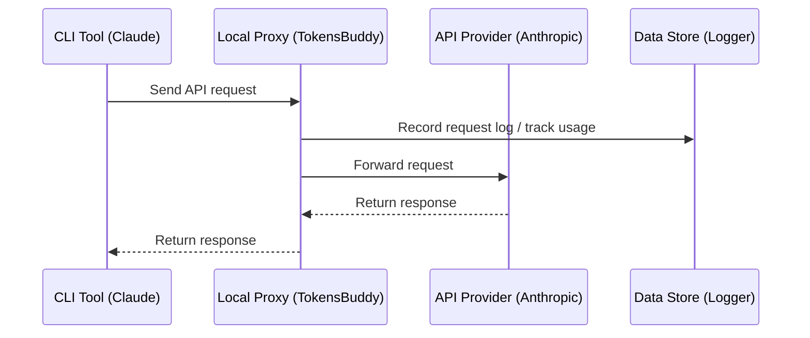

# 4.1 Proxy Service

## Overview

The proxy service starts a local HTTP proxy through which all API requests are forwarded.

**Primary uses**:
- Record request logs
- Track API usage
- Support failover
- Centrally manage requests from multiple applications

## Start the Proxy

### Option 1: Main Interface Toggle

Click the **Proxy Toggle** button at the top of the main interface.

Toggle states:
- White: Proxy not running
- Green: Proxy running


### Option 2: Settings Page

1. Open "Settings > Advanced > Proxy Service"
2. Click the toggle in the top-right corner


## Proxy Configuration

### Basic Configuration

| Setting | Description | Default |
|---------|-------------|---------|
| Listen Address | IP address the proxy binds to | `127.0.0.1` |
| Listen Port | Port the proxy listens on | `15721` |
| Enable Logging | Whether to record request logs | Enabled |

### Modify Configuration

1. **Stop the proxy service** (must stop first)
2. Modify the listen address or port
3. Click "Save"
4. Restart the proxy

> Modifying address/port requires stopping the proxy service first

### Listen Address Options

| Address | Description |
|---------|-------------|
| `127.0.0.1` | Only accessible from local machine (recommended) |
| `0.0.0.0` | Allow LAN access |

## Running Status

When the proxy is running, the panel displays the following information:

### Service Address

```
http://127.0.0.1:15721
```

Click the "Copy" button to copy the address.

### Current Providers

Displays the currently used provider for each app:

```
Claude: PackyCode
Codex: AIGoCode
Gemini: Google Official
```

### Statistics

| Metric | Description |
|--------|-------------|
| Active Connections | Number of requests currently being processed |
| Total Requests | Total number of requests since startup |
| Success Rate | Percentage of successful requests (>90% green, <=90% yellow) |
| Uptime | How long the proxy has been running |

### Failover Queue

The proxy panel displays the failover queue by app type:

```
Claude
├── 1. PackyCode      [Currently Using] ●
├── 2. AIGoCode                          ●
└── 3. Backup Provider                   ○

Codex
├── 1. AIGoCode       [Currently Using] ●
└── 2. Backup Provider                   ●
```

Queue details:
- Numbers indicate priority order
- "Currently Using" label indicates the active provider
- Health badges show provider status:
  - Green: Healthy (0 consecutive failures)
  - Yellow: Degraded (1-2 consecutive failures)
  - Red: Unhealthy (3+ consecutive failures)

## How It Works

### Request Flow



### Configuration Changes

After starting the proxy and enabling app takeover, TokensBuddy modifies app configurations:

**Claude**:
```json
{
  "env": {
    "ANTHROPIC_BASE_URL": "http://127.0.0.1:15721"
  }
}
```

**Codex**:
```toml
base_url = "http://127.0.0.1:15721/v1"
```

**Gemini**:
```
GOOGLE_GEMINI_BASE_URL=http://127.0.0.1:15721
```

## API Format Conversion

The proxy supports automatic API format conversion for providers configured with non-Anthropic formats. This allows you to use providers that only support OpenAI-compatible APIs with Claude Code.

| Provider API Format | Proxy Behavior |
|---------------------|----------------|
| **Anthropic Messages** | Pass-through (no conversion) |
| **OpenAI Chat Completions** | Converts Anthropic requests to OpenAI Chat format and responses back |
| **OpenAI Responses API** | Converts Anthropic requests to OpenAI Responses format and responses back |

The API format is configured per-provider in the [Advanced Options](../2-providers/2.1-add.md#api-format-claude-only) when adding or editing a Claude provider.

> **Note**: Format conversion requires the proxy to be running with app takeover enabled. The conversion handles both streaming and non-streaming requests.

## Stop the Proxy

### Option 1: Main Interface Toggle

Click the proxy toggle button to turn it off.

### Option 2: Settings Page

Turn off the toggle in the proxy service panel.

### Post-stop Processing

When stopping the proxy, TokensBuddy will:

1. Restore app configurations to their original state
2. Save request logs
3. Close all connections

## Log Recording

### Enable Logging

Enable the "Enable Logging" toggle in the proxy panel.

### Log Contents

Each request record includes:

| Field | Description |
|-------|-------------|
| Time | Request time |
| App | Claude / Codex / Gemini |
| Provider | Provider used |
| Model | Requested model |
| Tokens | Input/output token count |
| Latency | Request duration |
| Status | Success/failure |

### View Logs

View request logs in the "Settings > Usage" tab.

## FAQ

### Port Already in Use

Error message: `Address already in use`

Solution:
1. Change the port (e.g., to 5001)
2. Or close the program occupying the port

### Proxy Fails to Start

Check:
- Is the port occupied
- Are there sufficient permissions
- Is the firewall blocking it

### Request Timeout

Possible causes:
- Network issues
- Provider server issues
- Incorrect proxy configuration

Solutions:
- Check network connection
- Try accessing the provider API directly
- Check provider configuration
