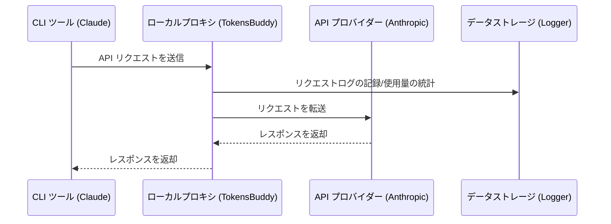

# 4.1 プロキシサービス

## 機能説明

プロキシサービスは、ローカルで HTTP プロキシを起動し、すべての API リクエストをプロキシ経由で転送します。

**主な用途**：
- リクエストログの記録
- API 使用量の統計
- フェイルオーバーのサポート
- 複数アプリのリクエストを一元管理

## プロキシの起動

### 方法 1：メイン画面のスイッチ

メイン画面上部の **プロキシスイッチ** ボタンをクリックします。

スイッチの状態：
- 白：プロキシ停止中
- 緑：プロキシ実行中


### 方法 2：設定ページ

1. 「設定 → 詳細 → プロキシサービス」を開く
2. 右上のスイッチをクリック


## プロキシ設定

### 基本設定

| 設定項目 | 説明 | デフォルト値 |
|--------|------|--------|
| リスニングアドレス | プロキシがバインドする IP アドレス | `127.0.0.1` |
| リスニングポート | プロキシがリスニングするポート | `15721` |
| ログを有効化 | リクエストログを記録するかどうか | オン |

### 設定の変更

1. **プロキシサービスを停止**（先に停止する必要あり）
2. リスニングアドレスまたはポートを変更
3. 「保存」をクリック
4. プロキシを再起動

> アドレス/ポートの変更には、先にプロキシサービスの停止が必要です

### リスニングアドレスの説明

| アドレス | 説明 |
|------|------|
| `127.0.0.1` | ローカルマシンのみアクセス可能（推奨） |
| `0.0.0.0` | LAN からのアクセスを許可 |

## 実行状態

プロキシ実行中、パネルには以下の情報が表示されます：

### サービスアドレス

```
http://127.0.0.1:15721
```

「コピー」ボタンでアドレスをコピーできます。

### 現在のプロバイダー

各アプリが現在使用しているプロバイダーを表示：

```
Claude: PackyCode
Codex: AIGoCode
Gemini: Google 公式
```

### 統計データ

| 指標 | 説明 |
|------|------|
| アクティブ接続 | 現在処理中のリクエスト数 |
| 総リクエスト数 | 起動以来の総リクエスト数 |
| 成功率 | リクエスト成功の割合（>90% 緑、≤90% 黄） |
| 実行時間 | プロキシの稼働時間 |

### フェイルオーバーキュー

プロキシパネルにはアプリタイプごとにフェイルオーバーキューが表示されます：

```
Claude
├── 1. PackyCode      [使用中] ●
├── 2. AIGoCode                ●
└── 3. バックアップ              ○

Codex
├── 1. AIGoCode       [使用中] ●
└── 2. バックアップ              ●
```

キューの説明：
- 数字は優先順位を示す
- 「使用中」ラベルは現在使用しているプロバイダーを示す
- ヘルスバッジはプロバイダーの状態を示す：
  - 緑：健康（連続失敗 0 回）
  - 黄：低下（連続失敗 1-2 回）
  - 赤：不健康（連続失敗 ≥3 回）

## 動作原理

### リクエストフロー



### 設定の変更

プロキシを起動してアプリケーション接管を有効にすると、TokensBuddy はアプリの設定を変更します：

**Claude**：
```json
{
  "env": {
    "ANTHROPIC_BASE_URL": "http://127.0.0.1:15721"
  }
}
```

**Codex**：
```toml
base_url = "http://127.0.0.1:15721/v1"
```

**Gemini**：
```
GOOGLE_GEMINI_BASE_URL=http://127.0.0.1:15721
```

## API フォーマット変換

プロキシは、Anthropic 以外のフォーマットが設定されたプロバイダーに対して、API フォーマットの自動変換をサポートします。これにより、OpenAI 互換 API のみをサポートするプロバイダーを Claude Code で使用できます。

| プロバイダー API フォーマット | プロキシの動作 |
|------|------|
| **Anthropic Messages** | パススルー（変換なし） |
| **OpenAI Chat Completions** | Anthropic リクエストを OpenAI Chat フォーマットに変換し、レスポンスを逆変換 |
| **OpenAI Responses API** | Anthropic リクエストを OpenAI Responses フォーマットに変換し、レスポンスを逆変換 |

API フォーマットはプロバイダーごとに、Claude プロバイダーの追加・編集時の[高度なオプション](../2-providers/2.1-add.md#api-フォーマットclaude-のみ)で設定します。

> **注意**：フォーマット変換にはプロキシがアプリ接管有効の状態で稼働している必要があります。変換はストリーミングと非ストリーミングの両方のリクエストに対応しています。

## プロキシの停止

### 方法 1：メイン画面のスイッチ

プロキシスイッチボタンをクリックしてオフにします。

### 方法 2：設定ページ

プロキシサービスパネルでスイッチをオフにします。

### 停止後の処理

プロキシの停止時、TokensBuddy は以下を実行します：

1. アプリの設定を元の状態に復元
2. リクエストログを保存
3. すべての接続を閉じる

## ログ記録

### ログの有効化

プロキシパネルの「ログを有効化」スイッチをオンにします。

### ログの内容

各リクエスト記録には以下が含まれます：

| フィールド | 説明 |
|------|------|
| 時間 | リクエスト時刻 |
| アプリ | Claude / Codex / Gemini |
| プロバイダー | 使用されたプロバイダー |
| モデル | リクエストされたモデル |
| Token | 入力/出力の Token 数 |
| レイテンシ | リクエストにかかった時間 |
| ステータス | 成功/失敗 |

### ログの表示

「設定 → 使用量」タブでリクエストログを表示できます。

## よくある質問

### ポートが使用中

エラーメッセージ：`Address already in use`

解決方法：
1. ポートを変更する（例：5001）
2. またはそのポートを使用しているプログラムを終了する

### プロキシの起動に失敗する

確認事項：
- ポートが使用中でないか
- 十分な権限があるか
- ファイアウォールがブロックしていないか

### リクエストがタイムアウトする

考えられる原因：
- ネットワークの問題
- プロバイダーのサーバーの問題
- プロキシ設定のエラー

解決方法：
- ネットワーク接続を確認
- プロバイダーの API に直接アクセスを試みる
- プロバイダーの設定を確認
