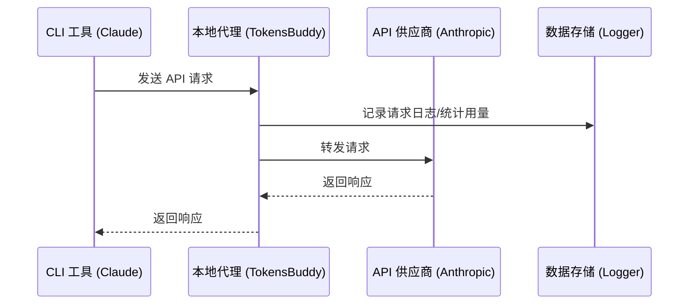

# 4.1 代理服务

## 功能说明

代理服务在本地启动一个 HTTP 代理，所有 API 请求都通过代理转发。

**主要用途**：
- 记录请求日志
- 统计 API 用量
- 支持故障转移
- 集中管理多个应用的请求

## 启动代理

### 方式一：主界面开关

点击主界面顶部的 **代理开关** 按钮。

开关状态：
- 🔴 白色：代理未运行
- 🟢 绿色：代理运行中


### 方式二：设置页面

1. 打开「设置 → 高级 → 代理服务」
2. 点击右上角的开关


## 代理配置

### 基础配置

| 配置项 | 说明 | 默认值 |
|--------|------|--------|
| 监听地址 | 代理绑定的 IP 地址 | `127.0.0.1` |
| 监听端口 | 代理监听的端口 | `15721` |
| 启用日志 | 是否记录请求日志 | 开启 |

### 修改配置

1. **停止代理服务**（必须先停止）
2. 修改监听地址或端口
3. 点击「保存」
4. 重新启动代理

> ⚠️ 修改地址/端口需要先停止代理服务

### 监听地址说明

| 地址 | 说明 |
|------|------|
| `127.0.0.1` | 仅本机可访问（推荐） |
| `0.0.0.0` | 允许局域网访问 |

## 运行状态

代理运行时，面板显示以下信息：

### 服务地址

```
http://127.0.0.1:15721
```

点击「复制」按钮可复制地址。

### 当前供应商

显示各应用当前使用的供应商：

```
Claude: PackyCode
Codex: AIGoCode
Gemini: Google 官方
```

### 统计数据

| 指标 | 说明 |
|------|------|
| 活跃连接 | 当前正在处理的请求数 |
| 总请求数 | 启动以来的总请求数 |
| 成功率 | 请求成功的百分比（>90% 绿色，≤90% 黄色） |
| 运行时间 | 代理已运行的时长 |

### 故障转移队列

代理面板会按应用类型显示故障转移队列：

```
Claude
├── 1. PackyCode      [当前使用] ●
├── 2. AIGoCode                  ●
└── 3. 备用供应商                 ○

Codex
├── 1. AIGoCode       [当前使用] ●
└── 2. 备用供应商                 ●
```

队列说明：
- 数字表示优先级顺序
- 「当前使用」标签表示正在使用的供应商
- 健康徽章显示供应商状态：
  - 🟢 绿色：健康（连续失败 0 次）
  - 🟡 黄色：降级（连续失败 1-2 次）
  - 🔴 红色：不健康（连续失败 ≥3 次）

## 工作原理

### 请求流程



### 配置修改

启动代理并开启应用接管后，TokensBuddy 会修改应用配置：

**Claude**：
```json
{
  "env": {
    "ANTHROPIC_BASE_URL": "http://127.0.0.1:15721"
  }
}
```

**Codex**：
```toml
base_url = "http://127.0.0.1:15721/v1"
```

**Gemini**：
```
GOOGLE_GEMINI_BASE_URL=http://127.0.0.1:15721
```

## API 格式转换

代理支持为配置了非 Anthropic 格式的供应商自动进行 API 格式转换。这使你可以将仅支持 OpenAI 兼容 API 的供应商用于 Claude Code。

| 供应商 API 格式 | 代理行为 |
|-----------------|----------|
| **Anthropic Messages** | 透传（不转换） |
| **OpenAI Chat Completions** | 将 Anthropic 请求转换为 OpenAI Chat 格式，响应反向转换 |
| **OpenAI Responses API** | 将 Anthropic 请求转换为 OpenAI Responses 格式，响应反向转换 |

API 格式在添加或编辑 Claude 供应商时于[高级选项](../2-providers/2.1-add.md#api-格式仅-claude)中按供应商配置。

> **注意**：格式转换需要代理运行并启用应用接管。转换同时支持流式和非流式请求。

## 停止代理

### 方式一：主界面开关

点击代理开关按钮关闭。

### 方式二：设置页面

在代理服务面板中关闭开关。

### 停止后的处理

停止代理时，TokensBuddy 会：

1. 恢复应用配置到原始状态
2. 保存请求日志
3. 关闭所有连接

## 日志记录

### 开启日志

在代理面板中开启「启用日志」开关。

### 日志内容

每条请求记录包含：

| 字段 | 说明 |
|------|------|
| 时间 | 请求时间 |
| 应用 | Claude / Codex / Gemini |
| 供应商 | 使用的供应商 |
| 模型 | 请求的模型 |
| Token | 输入/输出 token 数 |
| 延迟 | 请求耗时 |
| 状态 | 成功/失败 |

### 查看日志

在「设置 → 用量」Tab 中查看请求日志。

## 常见问题

### 端口被占用

错误信息：`Address already in use`

解决方法：
1. 更换端口（如 5001）
2. 或关闭占用端口的程序

### 代理启动失败

检查：
- 端口是否被占用
- 是否有足够权限
- 防火墙是否阻止

### 请求超时

可能原因：
- 网络问题
- 供应商服务器问题
- 代理配置错误

解决方法：
- 检查网络连接
- 尝试直接访问供应商 API
- 检查供应商配置
